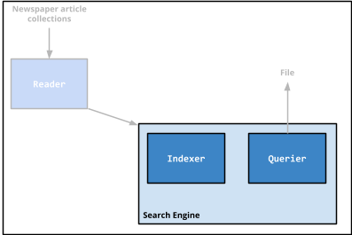

# Page1 Search Engine
This group project aims to acheive the best search engine performance for a collection of news articles from various sources.

## Original Repo:

  https://github.com/briantwhelan/page1-search-engine
  
## Overview

[Apache Lucene](https://lucene.apache.org/) is an open-source search engine library which provides methods for indexing and querying collections of documents.

In this project, a number of different implementations of Lucene are used to index and search newspaper article datasets from four different sources:
1. Financial Times Limited (1991, 1992, 1993, 1994),
2. Federal Register (1994),
3. Foreign Broadcast Information Service (1996)
4. Los Angeles Times (1989, 1990).

Multiple implementations are used to evaluate their respective performances using [trec_eval](https://trec.nist.gov/trec_eval/).



## Running the Search Engine
Before running*, trec_eval must be compiled and the relevant python packages must be installed. To do this, run the `install` script.

```sh
$ ./install.sh
```

To run the search engine, run the `run` script which does the following:

- Runs the search engine, outputting result files in `/results`
- Runs trec_eval against all of these results using the `qrels` as the groud truth, producing evaluation files in `/evaluation`
- Creates a markdown table, `compare.md`, containing the results for each of the implementations, enabling comparison

```sh
$ ./run.sh
```
*a Linux distribution is assumed with access to a bash terminal as well as having at least Java, Maven and Python installed

## Results
Below are condensed versions of the markdown tables generated in `compare.md` when running the search engine with the current configuration (`TF-IDF query creation`) as well as the baseline `topic title query creation` method (which can be found in this [branch](https://github.com/briantwhelan/page1-search-engine/tree/results-title)).

TLDR; out of the different implementations that were tested, the `CustomAnalyzer_Syn_stp-BM25Similarity` combination performed best for `TF-IDF query creation` with MAP 0.291 while the `GeneralizedCustomAnalyzer-BM25Similarity+LMDirichletSimilarity` performed best for `topic title query creation` with MAP 0.2933 (however there were many similarly performing combinations).

### Topic Title Query Creation
Note that the table shown below is a shortened version of the full results which can be found in `/evaluation`. 
Below are all Analyzer-Scorer combinations with a MAP score > 0.28.
| runid                                                          | map    | set_recall |
|----------------------------------------------------------------|--------|------------|
| CustomAnalyzer_Syn_stp-BM25Similarity                          | 0.2862 | 0.7555     |
| EnglishAnalyzer-BM25Similarity+LMDirichletSimilarity           | 0.2856 | 0.7653     |
| CustomAnalyzer_Syn_stp-LMJelinekMercerSimilarity               | 0.2803 | 0.762      |
| EnglishAnalyzer-LMDirichletSimilarity                          | 0.2826 | 0.7708     |
| EnglishAnalyzer-BM25Similarity                                 | 0.2909 | 0.7522     |
| GeneralizedCustomAnalyzer-LMDirichletSimilarity                | 0.2807 | 0.7645     |
| EnglishAnalyzer-LMJelinekMercerSimilarity                      | 0.2803 | 0.7604     |
| GeneralizedCustomAnalyzer-BM25Similarity+LMDirichletSimilarity | 0.2933 | 0.771      |
| GeneralizedCustomAnalyzer-BM25Similarity                       | 0.2917 | 0.7481     |
| CustomAnalyzer_Syn_stp-BM25Similarity+LMDirichletSimilarity    | 0.2907 | 0.7795     |
| CustomAnalyzer_Syn_stp-LMDirichletSimilarity                   | 0.2835 | 0.7634     |

### TF-IDF Query Creation
Note that the table shown below is a shortened version of the full results which can be found in `/evaluation`. 
Below are all Analyzer-Scorer combinations with a MAP score > 0.25.
| runid                                                          | map    | set_recall |
|----------------------------------------------------------------|--------|------------|
| GeneralizedCustomAnalyzer-LMJelinekMercerSimilarity            | 0.2639 | 0.7199     |
| CustomAnalyzer_Syn_stp-BM25Similarity                          | 0.291  | 0.7333     |
| GeneralizedCustomAnalyzer-ClassicSimilarity+BM25Similarity     | 0.2579 | 0.7047     |
| CustomAnalyzer_Syn_stp-LMJelinekMercerSimilarity               | 0.277  | 0.7338     |
| CustomAnalyzer_Syn_stp-ClassicSimilarity+BM25Similarity        | 0.2807 | 0.7302     |
| EnglishAnalyzer-BM25Similarity                                 | 0.2741 | 0.7157     |
| EnglishAnalyzer-ClassicSimilarity+BM25Similarity               | 0.2681 | 0.7192     |
| EnglishAnalyzer-LMJelinekMercerSimilarity                      | 0.2816 | 0.7436     |
| GeneralizedCustomAnalyzer-BM25Similarity+LMDirichletSimilarity | 0.2436 | 0.6731     |
| GeneralizedCustomAnalyzer-BM25Similarity                       | 0.2678 | 0.712      |
| CustomAnalyzer_Syn_stp-BM25Similarity+LMDirichletSimilarity    | 0.2586 | 0.7085     |

### Query Creation
Queries were created from [topics](./page1-search-engine/data/queries/topics.txt). The `QueryCreator` created these queries by using the combining the `title`, `description` and `narrative`, removing stop words and punctuation and then using TF-IDF to keep the top 10 keywords for each topic/query. This process results in these [queries](./page1-search-engine/data/queries/queries.txt) being generated when run.

Irrespective the `Analyzer-Scorer` combination used, the topic title query creation model appeared to outperform the TF-IDF query
creation model based on MAP scores alone. For instance, looking at the EnglishAnalyzer-BM25Similarity combination across both
query creation methods, the topic title method yields a MAP of 0.2909 while the TF-IDF approach only achieves 0.2741.
However, this evaluation only uses half of the queries (25 out of 50) and the MAP scores tend to be much more clustered across
Analyzer-Scorer combinations for the topic title model with
only 15 out of 42 combinations having MAP scores below 0.25 in contrast to 31 out of 42 using the TF-IDF model.
In addition, the query created via the topic title model is usually a subset of that created by the TF-IDF model. For example, for
the twenty eighth topic, the topic title model created the query "declining birth rates" while the TF-IDF model created the query
"birth rate declining u.s china year". The TF-IDF model generally provides more context in the query.

### [Analyzers](https://lucene.apache.org/core/8_1_0/core/org/apache/lucene/analysis/Analyzer.html)

The [WhitespaceAnalyzer](https://lucene.apache.org/core/8_1_0/analyzers-common/org/apache/lucene/analysis/core/WhitespaceAnalyzer.html), [SimpleAnalyzer](https://lucene.apache.org/core/8_1_0/analyzers-common/org/apache/lucene/analysis/core/SimpleAnalyzer.html), [StandardAnalyzer](https://lucene.apache.org/core/8_0_0/core/org/apache/lucene/analysis/standard/StandardAnalyzer.html) and [EnglishAnalyser](https://lucene.apache.org/core/8_10_1/analyzers-common/org/apache/lucene/analysis/en/EnglishAnalyzer.html) were each used as well as two custom analyzers.

Irrespective of the query creation method used, the `WhiteSpaceAnalyzer`, `SimpleAnalyzer` and `StandardAnalyzer` all performed
poorly with respect to the other analyzers used. 

Using the topic title query creation method, the `EnglishAnalyzer`
and two custom analyzers performed similarly, with all having MAP scores of ~0.29 when using the BM25 scorer. However, the 
lack of distinction between scorers here may be related to the query creation model.

In contrast, using the TF-IDF query creation model, while all perform well (MAP scores > 0.26 when using the BM25 scorer),
the `CustomAnalyzer_Syn_stp` provides a noticeable improvement
of ~0.02 from both other analyzers.

### [Scorers](https://lucenenet.apache.org/docs/4.8.0-beta00007/api/Lucene.Net/Lucene.Net.Search.Similarities.html)

The [Vector Space Model](https://lucene.apache.org/core/8_1_0/core/org/apache/lucene/search/similarities/ClassicSimilarity.html), [BM25 Model](https://lucene.apache.org/core/8_1_0/core/org/apache/lucene/search/similarities/BM25Similarity.html), [Dirichlet Model](https://lucenenet.apache.org/docs/4.8.0-beta00007/api/Lucene.Net/Lucene.Net.Search.Similarities.LMDirichletSimilarity.html) and [Jelinek-Mercer Model](https://lucenenet.apache.org/docs/4.8.0-beta00007/api/Lucene.Net/Lucene.Net.Search.Similarities.LMJelinekMercerSimilarity.html) as well as various combinations of these scorers (using [MultiSimilarity](https://lucenenet.apache.org/docs/4.8.0-beta00007/api/Lucene.Net/Lucene.Net.Search.Similarities.MultiSimilarity.html)) were tested in combination with the various analyzers.

Irrespective of the query creation method used, the `ClassicSimilarity` performed poorly with respect to the other analyzers used.
Using the topic title query creation method, the `BM25Similarity`, `LMDirichletSimilarity` and `LMJelinekMercerSimilarity` with
the `EnglishAnalyzer` performed well within the MAP score range 0.2803 to 0.2909. Again, the lack of distinction between scorers
here may be related to the query creation model. In contrast, using the TF-IDF query creation model, the BM25
scorer stands out in providing the best MAP scores. Taking the `CustomAnalyzer_Syn_stp`, the BM25 scorer achieves a MAP
score of 0.291 which drops to 0.277 when replaced with the next best `LMJelinekMercerSimilarity(0.7f)` scorer. Combinations also
work well, particularly those containing the BM25 model but they offer no substantial gains and in some case result in a drop
in MAP score.
